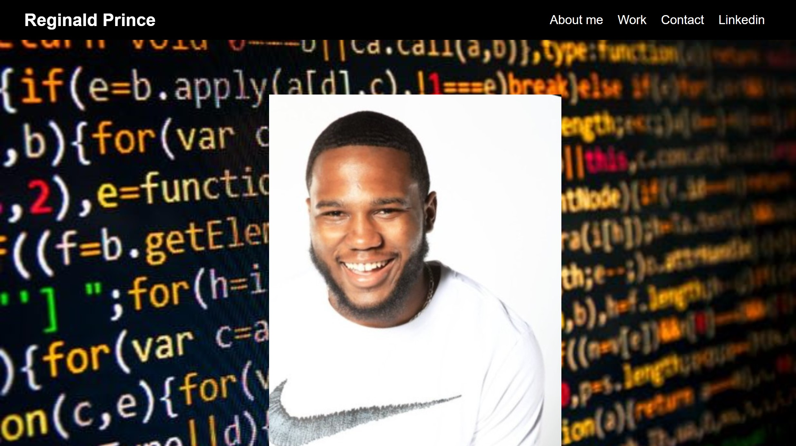

# Challenge2-Portfolio-Advanced CSS-Prince's Portfolio

## User Story

AS AN Student
I WANT to create a portfolio of work samples
SO THAT employers can review samples of my work and assess whether I am a good candidate for an open position

## Acceptance Criteria

GIVEN I need to sample my previous work
WHEN I load my portfolio
THEN I am presented with a name, a recent photo or avatar, and links to sections about me, work, and how to contact me
WHEN I click one of the links in the navigation
THEN the UI scrolls to the corresponding section
WHEN I click on the link to the section about  work
THEN the UI scrolls to a section with titled images of the applications
WHEN I am presented with the first application
THEN that application's image should be larger in size than the others
WHEN I click on the images of the applications
THEN I am taken to that deployed application
WHEN I resize the page or view the site on various screens and devices
THEN I am presented with a responsive layout that adapts to my viewport

## Screenshot of Deployed site

## Deployed Link
[Deployed Site] (https://reggiejr44.github.io/myportfolio-advancedcss/)
